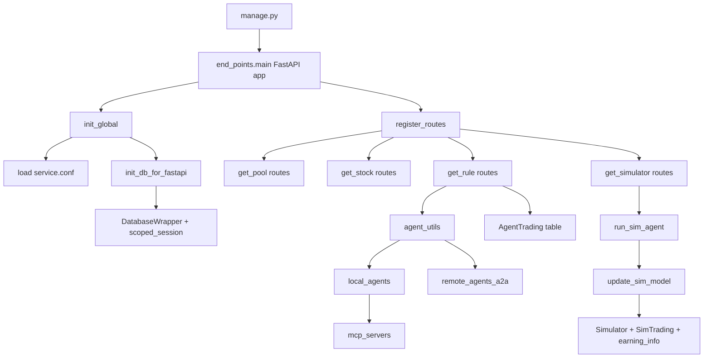

# Backend Architecture

## Source Anchors

- Source: end_points/main.py
- Source: end_points/init_global.py
- Source: end_points/config/db_init.py
- Source: end_points/config/routes.py
- Source: end_points/get_rule/operations/agent_utils.py
- Source: end_points/get_simulator/operations/get_simulator_utils.py

## Runtime Topology

## Main Architectural Units

### 1. API Shell

- FastAPI app is the control plane.
- Route registration is centralized in `end_points/config/routes.py`.
- Global exception handling returns `{code,message,detail}` on uncaught failures.
- CORS is fully open.

### 2. Compatibility Database Layer

- The codebase preserves a Flask-SQLAlchemy-like interface via `DatabaseWrapper`.
- One primary session is stored in `global_var['db']`.
- Additional engines are exposed via bind keys and `db.get_engine(bind_key)`.
- This allows older code to keep using `db.session` while specific read/write paths open bind-specific sessions.

### 3. CRUD + Calculation Services

- Each route module delegates to `operations/*.py`.
- These operations mix CRUD with domain calculations rather than separating repository/service layers.
- Serialization is done with Pydantic schemas or manual dictionaries.

### 4. Rule Execution Plane

- A `Rule` is both data and execution configuration.
- `Rule.type` distinguishes `agent`, `local_agent`, and `remote_agent`.
- `Rule.info` is overloaded:
  - JSON-like config for classic rules
  - Python import path for local agent rules
  - base URL for remote A2A rules
- Running a rule means:
  - resolve rule -> collect stocks from bound pools
  - invoke local or remote agent per stock
  - write a deduplicated `AgentTrading` row per `(rule_id, stock, trading_date)`

### 5. Simulator Replay Plane

- Simulators do not generate signals directly.
- They consume the already-generated `AgentTrading` records for a rule.
- Replay then:
  - maps indicated stocks to historical market data
  - synthesizes indicating/buy/sell/failure events
  - writes `SimTrading`
  - updates `Simulator` aggregate metrics and `earning_info`

### 6. Agent Tooling Plane

- `mcp_servers/` exposes FastMCP tool bundles for trading/news/technical data.
- `local_agents/tauric_mcp` and `local_agents/quant_agent_vlm` use those tool bundles directly.
- `local_agents/fingenius` is a larger internal agent framework with research, debate, MCP clients, reporting, and optimization traces.

## Key Couplings

- `get_rule` depends on `get_earn`, `get_stock`, and `get_simulator` helpers.
- `get_simulator` depends on `AgentTrading`, `Rule`, and market data fetch utilities.
- Agent execution and simulator replay are coupled through the `AgentTrading` table.
- Runtime config and DB handles are global rather than dependency-injected per module.

## Failure-Sensitive Areas

- `service.conf` executes as Python code via `exec()`
- global mutable state in `global_var`
- mixed sync/async agent execution bridged with thread executors
- file-backed simulator logs under `end_points/get_simulator/operations/sim_logs/`
- partially migrated code paths that still carry legacy comments and removed-model assumptions
